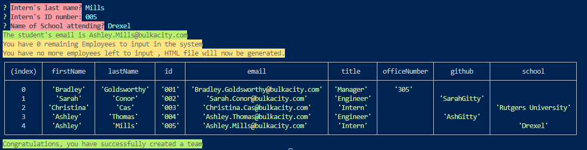

# Team_Profile_Generator

  The project is a command-line driven application, that shall be utilized along side your web app development process. A readme file with standard template will be generated and saved.
  
  [A deployed version can be viewed here.](https://bulkacity.github.io/Team_Profile_Generator/)
  
---
# Contents
1. [About](#About)
    1. [User Story](#user%20story)
    2. [Acceptance criteria](#acceptance%20criteria)
    3. [Visuals](#visuals)
    4. [Build](#build)
2. [Installation](#installation)
3. [License](#license)
4. [Contributing](#contributing)
5. [Tests](#tests)
6. [Video-How to use](#YoutubeChannel)
7. [Contact Information](#Contact%20Information)
---
## About
  Download as required, clone the repository for later usage.
---
## User Story

User Story
AS A manager
I WANT to generate a webpage that displays my team's basic info
SO THAT I have quick access to their emails and GitHub profiles
Acceptance Criteria
GIVEN a command-line application that accepts user input
WHEN I am prompted for my team members and their information
THEN an HTML file is generated that displays a nicely formatted team roster based on user input
WHEN I click on an email address in the HTML
THEN my default email program opens and populates the TO field of the email with the address
WHEN I click on the GitHub username
THEN that GitHub profile opens in a new tab
WHEN I start the application
THEN I am prompted to enter the team manager’s name, employee ID, email address, and office number
WHEN I enter the team manager’s name, employee ID, email address, and office number
THEN I am presented with a menu with the option to add an engineer or an intern or to finish building my team
WHEN I select the engineer option
THEN I am prompted to enter the engineer’s name, ID, email, and GitHub username, and I am taken back to the menu
WHEN I select the intern option
THEN I am prompted to enter the intern’s name, ID, email, and school, and I am taken back to the menu
WHEN I decide to finish building my team
THEN I exit the application, and the HTML is generated

---
## Acceptance Criteria
  
Satisfies all of the preceding acceptance criteria plus the following:

Uses the Inquirer package Links to an external site..

Uses the Jest package Links to an external site.for a suite of unit tests.

The application must have these classes: Employee, Manager, Engineer, and Intern.
---
## Visuals:

---
## Installation:
  Run npm install, and ensure to change the parameters for the package "inquirer": "^8.2.4".

---
## License
  License used for this project - MIT

---
## Contributing:
  
 Steps :
 No contribution from outside sources are allowed, acceptable to clone and create alternate versions of noted program. 

---
## Tests:
  Test instructions to be implemented on a later iteration, conduct generateMDfile.js test. We will expect a series of answers to be stored.

---
## YoutubeChannel
   [Watch a video linked here :](https://www.youtube.com/watch?v=R98qPgKgSi0)
---
## Contact Information:
* GitHub Username: BulkAcity
* GitHub Email: BG@bulkacity.com
  
